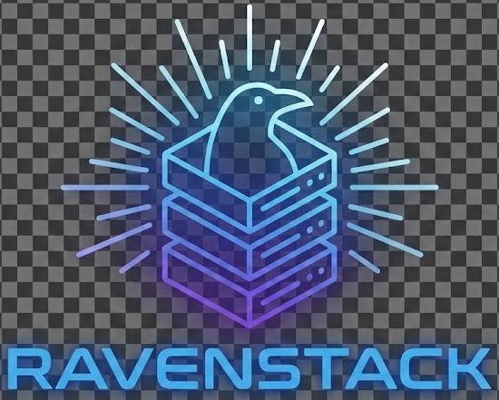
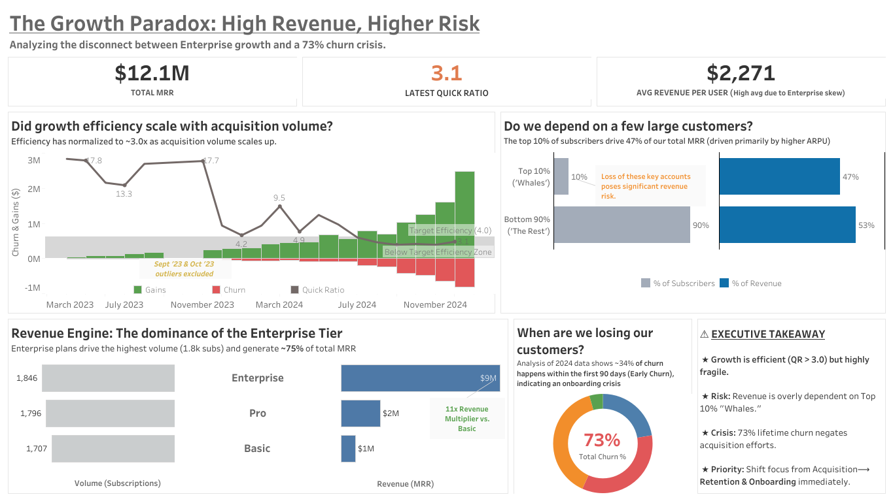
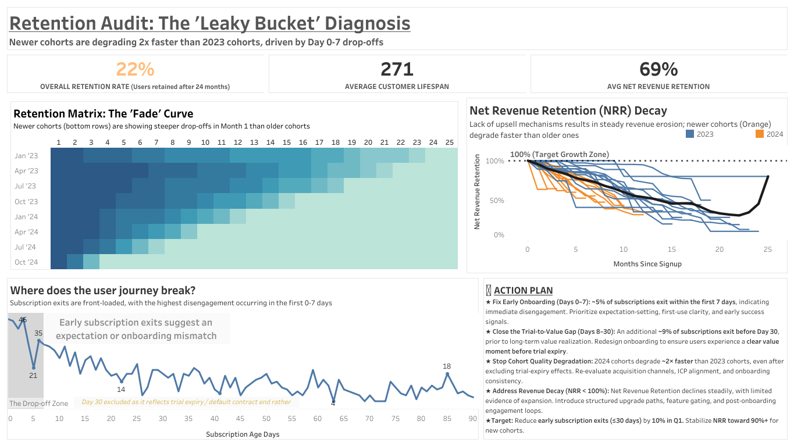
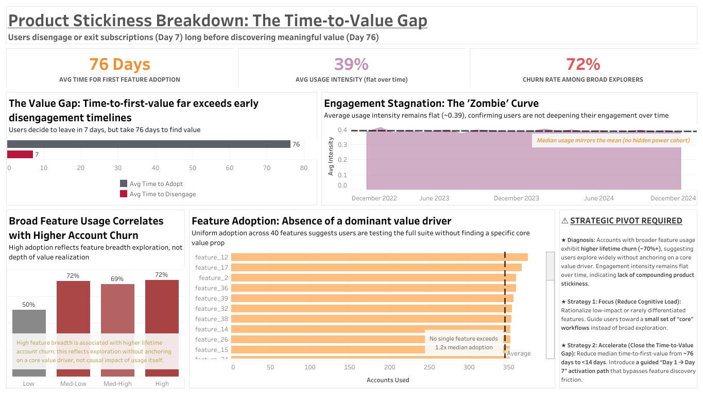
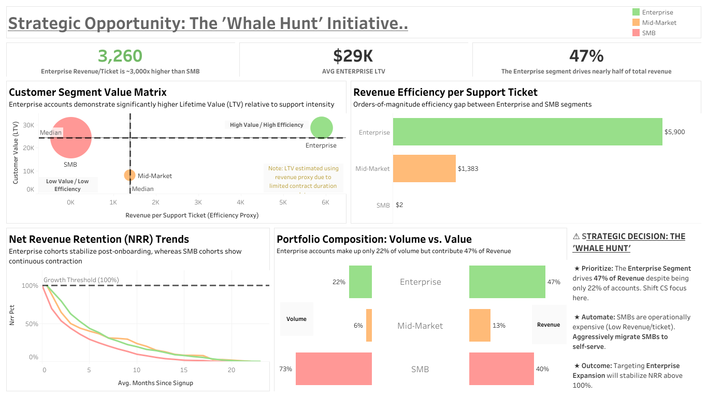

# Ravenstack SaaS Growth & Retention Analytics

> *Diagnosing growth quality, churn risk, and product value delivery in a subscription SaaS business*

---

<p align="center">
  
</p>

---

## ⚡ **Executive TL;DR**

**The Problem**  
Strong acquisition masked a retention crisis. Despite rapid customer growth, Net Revenue Retention (NRR) flattened and lifetime churn reached **73%**, threatening long-term revenue stability.

**The Diagnosis**  
Churn was heavily **front-loaded**. Nearly **60% of users exited within the first 30 days**, driven by product complexity and a severe **time-to-value gap** (users churned ~7 days in, while meaningful value arrived ~76 days later).

**The Solution**  
A clear **“Whale Hunt” strategy** emerged. While SMBs drove volume, **Enterprise customers (≈22% of users) generated ≈47% of revenue** with **~3,000× higher support efficiency**, making them the most defensible path to sustainable growth.

---

## 🏢 **Client Background & Analytics Context**

Ravenstack is a fictional **B2B subscription-based SaaS company** operating across multiple plan tiers (SMB, Mid-Market, Enterprise).  
As the business enters a **scaling phase**, leadership faces growing **churn risk** and requires cross-functional visibility across **Product, Growth, Customer Success, and Revenue teams**.

As the business enters a scaling phase, leadership requires deeper visibility into whether:
- Whether revenue growth is sustainable
- Where and why customers churn
- Whether product usage translates into long-term value
- Which customer segments truly justify continued investment

### Key Stakeholders
- **Product Leadership** – responsible for onboarding experience and feature adoption  
- **Growth & Marketing** – focused on acquisition efficiency and funnel performance  
- **Customer Success** – accountable for churn reduction and expansion  
- **Revenue & Finance** – concerned with MRR stability, LTV, and concentration risk  

This analysis was commissioned to support **cross-functional decision-making**, not just reporting.

---

## 🎯 **Business Problem & Objective**

### Business Problem
Despite strong headline revenue growth, Ravenstack faces several unresolved risks:
- High customer churn offsets acquisition gains
- Retention appears to be weakening for newer cohorts
- Product usage does not clearly correlate with customer longevity
- A small segment of customers contributes a disproportionate share of revenue

These signals raise a critical question:  
**Is Ravenstack scaling efficiently, or accumulating hidden risk beneath strong top-line growth?**

### Objective
The objective of this analysis is to:
- Evaluate the **quality of growth**, not just its magnitude
- Identify **where in the customer lifecycle value breaks down**
- Assess whether **product adoption drives retention**
- Quantify **customer segment value and operational efficiency**
- Surface **clear, actionable strategic recommendations**

---

## ⭐ North Star Metrics & Analytical Focus

The analysis is anchored around a focused set of North Star metrics that collectively describe growth health, retention strength, and customer value:

- **Total Monthly Recurring Revenue (MRR)**  
  Measures business scale and revenue concentration risk.

- **Quick Ratio**  
  Evaluates growth efficiency by comparing revenue gains to churn and contraction.

- **Churn Rate (Lifetime & Early-Stage)**  
  Identifies whether acquisition efforts translate into durable customers.

- **Net Revenue Retention (NRR)**  
  Assesses expansion, contraction, and long-term revenue stability.

- **Time-to-Value**  
  Measures how quickly users realize meaningful product value.

- **ARPU & LTV (Proxy)**  
  Used to compare customer segment value and prioritize investment.

These metrics guide every dashboard and insight in the project.

---

## 🧭 Analytical Approach

The analysis follows a **top-down diagnostic framework**, moving from growth outcomes to root causes:

1. **Growth Efficiency Analysis**  
   Evaluates whether revenue gains outpace churn and contraction.

2. **Retention & Cohort Analysis**  
   Identifies when customers churn and how retention patterns evolve over time.

3. **Product Usage & Time-to-Value Analysis**  
   Assesses whether users meaningfully engage with the product before churning.

4. **Segment-Level Value & Efficiency Analysis**  
   Compares customer segments by lifetime value relative to operational cost.

**Note:** Net Revenue Retention (NRR) and cohort-based retention metrics were computed using Python  
(see [`src/03_eda1.py`](src/03_eda1.py) and [`src/04_eda2.py`](src/04_eda2.py) for cohort and retention logic).

This structured approach ensures insights are **diagnostic and causal, not merely descriptive**.

---

## 📊 Executive Summary (North Star View)

At a surface level, Ravenstack appears healthy, with strong MRR growth and a Quick Ratio consistently above 3.0, indicating efficient acquisition.

However, deeper analysis reveals a critical structural imbalance. **Lifetime churn reaches 73%**, meaning the majority of acquired customers eventually exit the platform, significantly eroding long-term value. A large share of churn occurs within the **first 7–30 days**, pointing to onboarding and expectation mismatch rather than pricing or competition.

Product analysis shows that users often churn **before discovering meaningful value**, with average time-to-value far exceeding the time it takes customers to decide to leave. Meanwhile, revenue is increasingly concentrated among a small set of high-value Enterprise customers, creating both opportunity and risk.

Together, these signals indicate that Ravenstack’s growth is **efficient but fragile**, requiring an immediate shift in focus from acquisition to **retention, onboarding, and strategic customer prioritization**.

<p align="center">
  
</p>

---

## 🪣 Retention Audit: The “Leaky Bucket” (Churn Is Front-Loaded)

**Business Question**  
Are customers leaving gradually over time, or is churn concentrated at specific moments in the lifecycle?

### Key Findings
- **73% lifetime churn** indicates that most acquired customers eventually exit the platform.
- A significant share of churn occurs **within the first 7–30 days**, pointing to early disengagement rather than long-term dissatisfaction.
- **Newer cohorts degrade nearly 2× faster** than older cohorts, suggesting that recent growth has come at the cost of retention quality.
- Net Revenue Retention (NRR) shows a **steady downward trajectory**, with limited evidence of meaningful upsell or expansion.

### Why This Matters
High acquisition efficiency is negated if customers churn before delivering long-term value. Early churn signals an **expectation mismatch or onboarding failure**, not pricing or competitive pressure.

Without intervention, continued acquisition will compound churn faster than it compounds growth.

<p align="center">
  
</p>

---

## ⏱️ Product Stickiness: The “Time-to-Value” Crisis (Value Arrives Too Late)

**Business Question**  
Do customers experience meaningful value from the product before deciding to churn?

### Key Findings
- Average **time-to-churn is ~7 days**, while average **time-to-first meaningful adoption is ~76 days**.
- Users are making churn decisions **long before discovering product value**.
- Usage intensity remains **flat over time**, indicating shallow engagement rather than progressive adoption.
- Customers who explore more features (“Broad Explorers”) paradoxically show **higher churn**, suggesting confusion rather than value realization.
- No single feature emerges as a clear “hero” driver of retention.

### Why This Matters
The product is failing to guide users to value quickly. Feature breadth without guidance increases cognitive load, delaying value discovery and accelerating churn.

This is not a feature quantity problem, but a **value delivery and onboarding design problem**.

<p align="center">
  
</p>

---

## 🐋 Strategic Opportunity: The “Whale Hunt” (Pivoting from Volume to Value)

**Business Question**  
Are all customers equally valuable, or should Ravenstack focus on a narrower, higher-impact segment?

### Key Findings
- The **top 10% of customers drive ~47% of total revenue**, indicating heavy revenue concentration.
- **Enterprise customers generate ~3,000× more revenue per support ticket** compared to SMBs.
- Enterprise cohorts show **NRR stabilization post-onboarding**, while SMB cohorts continue to contract.
- SMB customers represent the majority of volume but deliver **low lifetime value and high operational cost**.

### Why This Matters
Not all growth is equal. Treating all segments identically dilutes focus and increases operational drag.

The data supports a clear, defensible strategic pivot:
- **Prioritize Enterprise retention and expansion**
- **Aggressively migrate SMB customers to self-serve**
- Align Product, CS, and Growth efforts around high-LTV accounts

This “Whale Hunt” strategy offers the most realistic path to stabilizing NRR and reducing churn-driven revenue loss.

<p align="center">
  
</p>

---

## 🔗 Cross-Dashboard Narrative: From Growth to Strategy

Taken together, the four dashboards reveal a consistent story.

Ravenstack’s **acquisition engine is efficient**, as reflected by a strong Quick Ratio and growing MRR. However, this efficiency masks a deeper issue: **customers churn faster than they realize value**, causing long-term revenue leakage.

Retention analysis shows that churn is **front-loaded**, concentrated in the first few weeks of the customer lifecycle. Product usage data explains why: users are overwhelmed by feature breadth and fail to reach meaningful value quickly. As a result, engagement remains shallow and time-to-value exceeds time-to-churn by a wide margin.

Segment-level analysis resolves the strategic tension. While SMB customers drive volume, **Enterprise customers deliver durable revenue with far greater efficiency**. Treating all segments equally has diluted focus and increased operational cost.

The implication is clear: Ravenstack’s challenge is not growth, but **growth quality**. Solving retention and prioritizing high-value segments offers a far higher return than accelerating acquisition.

---

## 💡 Key Business Insights (Consolidated)

- Growth is **efficient but fragile**, with churn offsetting acquisition gains over time.
- Retention failures are **early-stage**, pointing to onboarding and expectation mismatch rather than long-term dissatisfaction.
- Product usage does not naturally deepen over time, confirming a **time-to-value gap**.
- Feature breadth without guidance increases churn instead of retention.
- Enterprise customers generate outsized value relative to operational effort.
- SMB growth adds volume but introduces disproportionate cost and revenue risk.

---

## 🧹 **Data Quality & Cleaning Summary**

Before analysis, a dedicated data validation and cleaning pipeline (ETL1) was executed to ensure **accuracy, consistency, and auditability** across all datasets and establish a **reliable analytical foundation**.

A summary dashboard highlighting:
- Data quality issues identified  
- Corrections and imputations applied  
- Validation coverage across core tables  

is available here:

📊 **[View Data Cleaning Summary Dashboard](./dashboards/00_data_cleaning_summary.png)**

Detailed cleaning logic, validation outputs, and correction logs are documented in the `data/etl1/` and `excel/` folders.

---

## 🔮 **What I’d Do Next With More Data**

With access to additional data, this analysis could be extended to:

- **Session-level product logs**  
  → Identify precise drop-off moments within onboarding and build early churn predictors.

- **Contract terms and billing data**  
  → Replace LTV proxies with true lifetime value and renewal risk modeling.

- **Customer feedback and support sentiment**  
  → Quantify qualitative friction points contributing to early churn.

These additions would enable **predictive retention modeling and targeted intervention strategies**.

---

## ⚠️ **Assumptions & Limitations**

- LTV is estimated using revenue proxies due to limited contract duration data.
- Usage intensity is aggregated and does not reflect session-level behavior.
- Retention analysis is based on observed churn events rather than predictive labels.
- The company and data are fictional but structured to reflect real-world SaaS behavior.

These limitations are acknowledged and do not invalidate the directional insights.

---

## 📂 **Repository Structure**

The repository is organized to reflect a real-world analytics workflow, separating raw data, transformation logic, and business outputs.

```markdown
📦 Project Root
├── data/            # Raw, cleaned, and feature-engineered datasets (CSV)
│   ├── raw/         # Original and intentionally messy source data
│   ├── etl1/        # Cleaning, validation, and data quality outputs
│   └── etl2/        # Feature engineering and analysis-ready datasets
├── src/             # Python scripts for ETL and EDA
├── dashboards/      # Final dashboard images (Excel + Tableau)
└── README.md        # Project documentation and narrative
```

This structure ensures transparency, reproducibility, and easy navigation for both technical and non-technical reviewers.

---

## 🧰 **Technical Stack**

- **Data Validation & Summaries:** Excel  
- **Data Processing & Feature Engineering:** Python  
- **Visualization:** Tableau  
- **Storage Format:** CSV-based, file-driven analytics pipeline

---

## 👥 **Stakeholder Lens**

This analysis is designed to support **Product, Growth, Customer Success, and Revenue leadership** in making informed decisions around retention, onboarding, and customer segment prioritization.

---

## ⭐ **Call-to-Action**

```markdown
# 📢 Call to Action

If you would like to:
- Explore the dataset in detail  
- Request a walkthrough of the dashboard  
- Discuss how to build similar BI solutions  
- Collaborate on analytics or portfolio projects  

Feel free to reach out or open an issue in the repository.

🚀 **Happy analyzing!**
```

